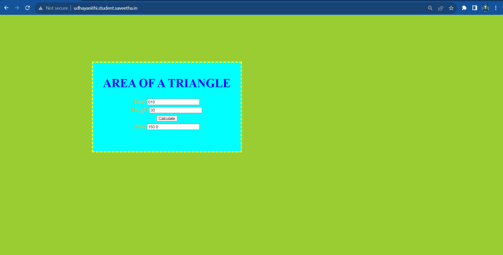

# Design a Website for Server Side Processing

## AIM:
To design a website to perform mathematical calculations in server side.

## DESIGN STEPS:

### Step 1:

Clone the repository from GitHub

### Step 2:

Create Django Admin project.

### Step 3:

Create a New App.

### Step 4: 
Create python programs for views and urls.

### Step 5:
Create a HTML file of forms.

### Step 6:
Publish the website in the given URL.

## PROGRAM :
```
math.html 

<!DOCTYPE html>
<html>
<head>
<meta charset='utf-8'>
<meta http-equiv='X-UA-Compatible' content='IE=edge'>
<title>Area of Triangle</title>
<meta name='viewport' content='width=device-width, initial-scale=1'>
<style type="text/css">
body 
{
background-color:yellowgreen;
}
.edge {
width: 1080px;
margin-left: auto;
margin-right: auto;
padding-top: 150px;
padding-left: 150pxs;
}
.box {
display:block;
border: Thick dashed yellow;
width: 500px;
min-height: 300px;
font-size: 20px;
background-color: cyan;
}
.formelt{
color:orange;
text-align: center;
margin-top: 5px;
margin-bottom: 5px;
}
h1
{
color:blue;
text-align: center;
padding-top: 20px;
}
</style>
</head>
<body>
<div class="edge">
<div class="box">
        <h1>AREA OF A TRIANGLE</h1>
        <form method="POST">
            
            <div class="formelt"> 
                Base:<input type="text" name="base" value={{b}}></input><br/>
            </div>
            <div class="formelt">
                Height:<input type="text" name="height" value={{h}}></input><br/>
            </div>
            <div class="formelt">
                <input type="submit" value="Calculate"></input><br/>
            </div>
            <div class="formelt">
                Area:<input type="text" name="area" value={{area}}></input>
            </div>
        </form>
    </div>
    
</body>
</html>

views.py

from django.shortcuts import render
from django.template  import loader
from django.shortcuts import render
# Create your views here.


def rectarea(request):
    context={}
    context['area'] = "0"
    context['b'] = "0"
    context['h'] = "0"
    if request.method == 'POST':
        print("POST method is used")
        b = request.POST.get('base','0')
        h = request.POST.get('height','0')
        print('request=',request)
        print('Base=',b)
        print('Height=',h)
        area = (0.5)*int(b) * int(h)
        context['area'] = area
        context['b'] = b
        context['h'] = h
        print('Area=',area)
    return render(request,'myapp/math.html',context)

urls.py

from django.contrib import admin

from myapp import views

from django.urls import path


urlpatterns = [
    path('admin/', admin.site.urls),
    path('areaoftriangle/',views.area,name="areaoftriangle"),
    path('',views.triarea,name="areaoftriangleroot")
   
]
```
## OUTPUT:


### Home Page:


## Result:
The program for implementing server side processing is completed successfully.

